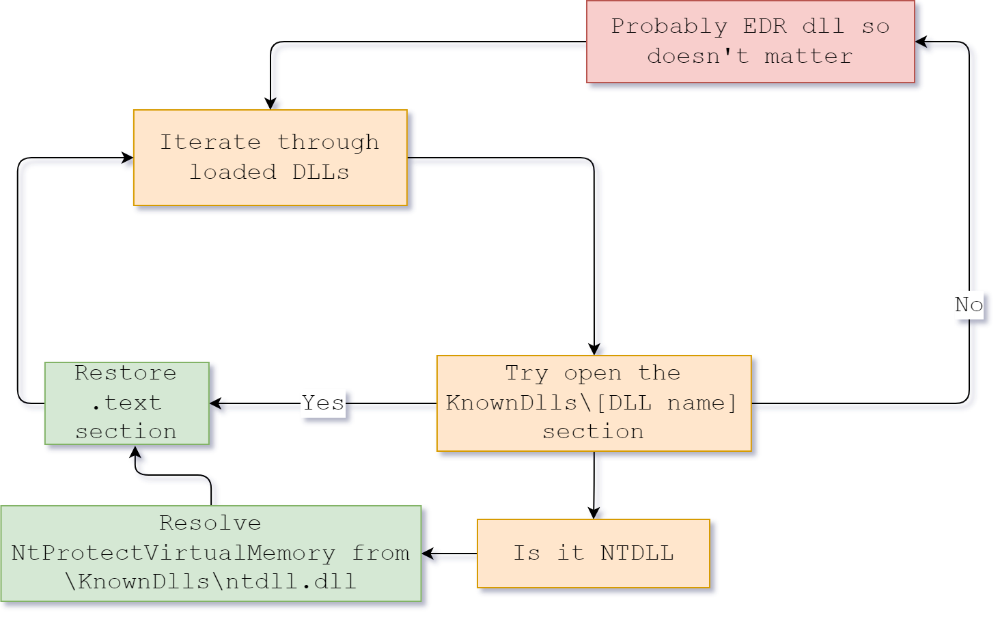

WTSRM - Writing Tiny Small Reliable Malware demo repository for my corresponding talk.

- Unhooks all Windows Dlls with \KnownDlls\
- No CRT dependencies
- Small size 
- Low entropy
- Random string encryption key
- API hashing
- Hook detection
- Walks around hooks for initial unhooking on ntdll

---

